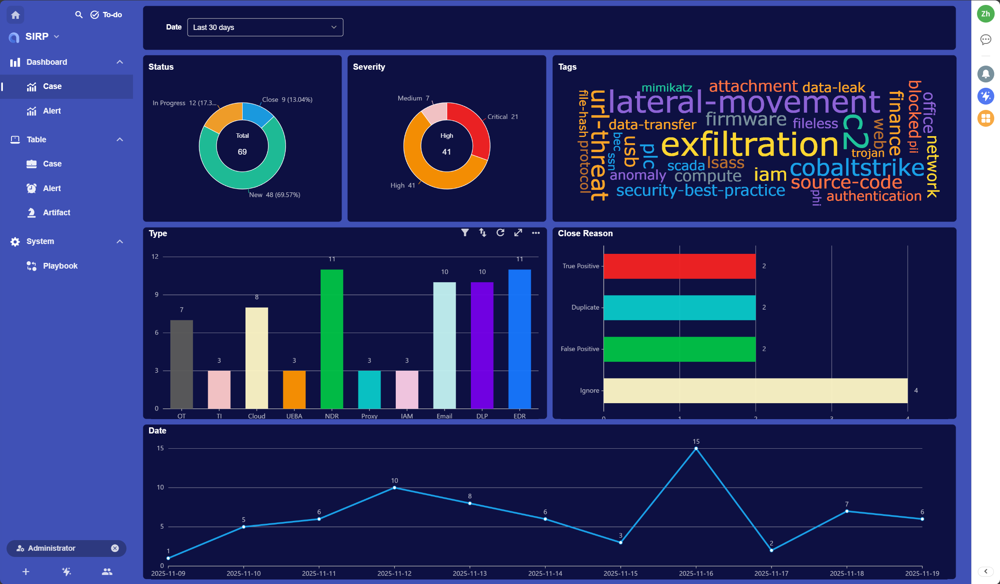
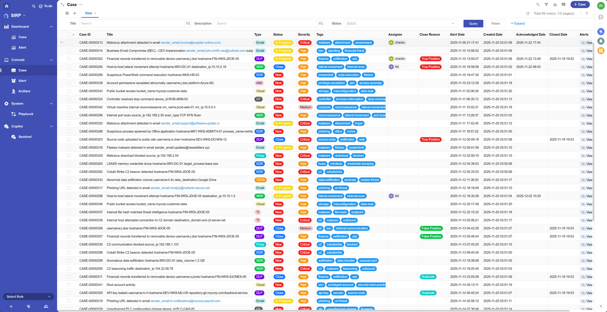
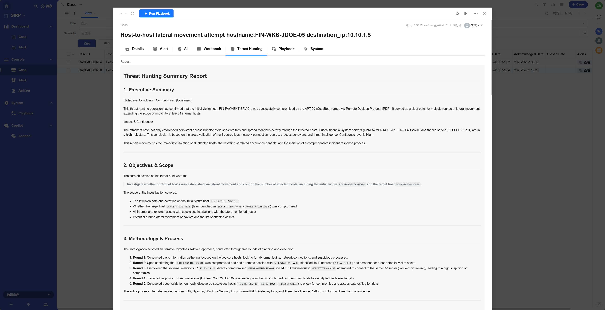
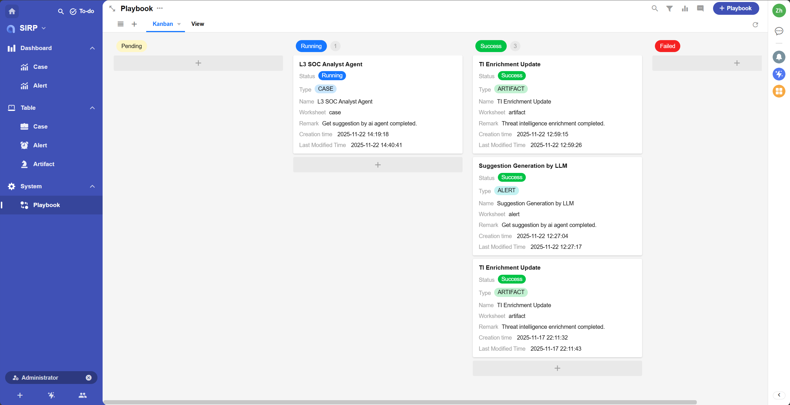
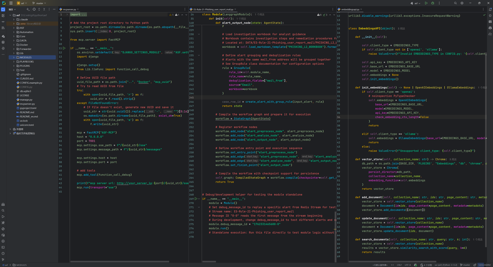

  <a href="https://asp.viperrtp.com/asf/Development/environment_setup/">Getting-started</a> ·
  <a href="https://asp.viperrtp.com/asf/Introduction/what_is_asf/">Documentation</a>

    
    
    
    
    

  
  

**Agentic SOC Platform** A powerful, flexible, open-source, and agent-centric automated security operations platform.

## Core Features

- 🧠 **AI-driven Intelligence**: Utilizes built-in AI Agent templates like Langgraph and Dify, supporting local LLMs to
  enhance alert analysis and automated response capabilities.
- 📊 **Built-in SIRP Platform**: Comes with a ready-to-use Security Incident Response Platform (SIRP) built on Nocoly,
  allowing for rapid customization of user interfaces, data models, reports, and workflows.
- ⚙️ **Powerful Automation Workflow**: Achieves efficient alert processing through Webhook + Redis Stream, natively
  supporting mainstream SIEM platforms such as Splunk and Kibana (ELK).
- 🛠️ **Highly Extensible**: Provides a rich library of modules and plugins. The entire framework is written in Python,
  facilitating secondary development and integration with various security devices and APIs.
- 🛡️ **Local Deployment & Data Control**: Supports complete local deployment. All data, models, and operations can be
  hosted within your own environment, ensuring enterprise data security and privacy.
- ⚡ **Streaming and Batch Processing**: Offers streaming processing (modules) for real-time alert analysis and
  event-driven automation (playbooks) for user-triggered tasks.

## Architecture Overview

ASP processes security alerts and incidents through a simplified multi-stage process:

1. **SIEM/Alert Sources**: EDR, NDR, or other security tools send alerts to a SIEM (e.g., Splunk, Kibana).
2. **Webhook Forwarder**: The SIEM forwards these alerts via Webhook to the ASP's built-in Webhook receiver.
3. **Redis Stream**: The receiver pushes the alerts to the corresponding Redis Stream, serving as a persistent message
   queue. Each alert type has its own stream.
4. **Module Engine**: ASP **modules** consume alerts from their designated streams, perform analysis (often using AI
   Agents), enrich data, and determine outcomes.
5. **SIRP Platform**: The output of the modules (now formatted into standardized security records) is sent to the **SIRP
   ** platform, where cases, alerts, and artifacts are created or updated.
6. **Playbook Engine**: Analysts can trigger **playbooks** from the SIRP user interface against cases, alerts, or
   artifacts to perform further automated actions, such as threat intelligence enrichment or remediation.

## Official Website

[https://asp.viperrtp.com](https://asp.viperrtp.com)

## 404Starlink

Agentic SOC Platform has joined [404Starlink](https://github.com/knownsec/404StarLink)